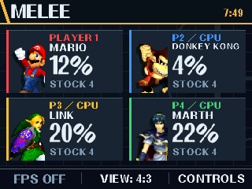
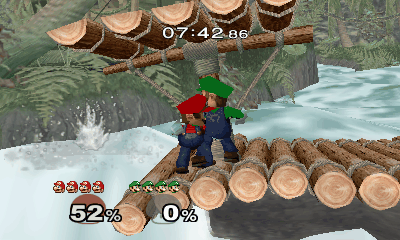

# Melee for New Nintendo 3DS

Super Smash Bros. Melee, running natively on a homebrewed **New Nintendo 3DS**. This fork of [doldecomp/melee](https://github.com/doldecomp/melee) brings the original game engine to ARM, with stereoscopic 3D, handheld controls, and a Melee-inspired touch-screen companion.

Play Versus against CPUs, practice in Training, and explore Melee on a different kind of handheld. The port aims to preserve the original mechanics while adapting the presentation to the 3DS. **Development is complete for now at a playable community milestone. Performance varies, and this is not a locked-60-FPS or fully compatible replacement for the GameCube game.**

<table>
  <tr>
    <th align="center">Your match at a glance</th>
    <th align="center">Melee with depth</th>
  </tr>
  <tr>
    <td align="center"></td>
    <td align="center"></td>
  </tr>
  <tr>
    <td align="center">Portraits, stocks, damage, and touch controls.</td>
    <td align="center">A left/right-eye wiggle preview. Click for a still.</td>
  </tr>
</table>

Actual port captures from Azahar. The GIF alternates eye views of one frame to illustrate depth; its animation speed does not represent gameplay FPS.

## Features

- Native stereoscopic **3D in gameplay and perspective menus**, adjusted with the system slider.
- **4:3 by default**, with an optional expanded view that reveals more of the scene without stretching it.
- A **touch-screen dashboard** with portraits, stocks, and damage for up to four fighters, plus menu guidance, an optional FPS display, a frame-rate mode switch, and **custom button mapping**.
- Original music and sound effects, **UCF 0.84 input fixes**, and **C-stick attacks in single-player modes**.
- **Two builds, installable side by side:** everything unlocked with editable tournament-friendly defaults, or a **fresh save** with vanilla options that you unlock by playing. Progress saves to the SD card as Dolphin-compatible memory-card files.
- **HOME Menu launch through an installable CIA**, with a disc icon and a Final Destination/Fox diorama. Homebrew Launcher is also supported.
- Optional **Diet Melee scenery** for five stages, simplifying visuals while retaining the original stage gameplay and collision.

## Performance to expect

These are approximate observations on a physical New 3DS with 3D on, not guarantees or emulator benchmarks:

| Scenario | Typical experience |
|---|---|
| 1v1 matches | **60 FPS** on most stages |
| Casual matches with four fighters on large stages | A steady **30 FPS** |
| A few single-player stages (for example Adventure's Underground Maze and Kirby team, or a Classic team battle) | Can still drop into the **teens or 20s** |

The game logic runs at full speed (60 updates per second) almost everywhere; in heavy scenes only the number of drawn frames drops. The bottom screen's rate button chooses **AUTO** (60 FPS, switching to an even 30 when a scene can't hold 60), **30**, or **60**. Stages, fighters, items, and effects all matter; prepared Diet scenery helps on its five stages.

## What you need

- A homebrewed **New Nintendo 3DS or New Nintendo 3DS XL**, with custom firmware and **FBI** for CIA installation. New 2DS XL is also targeted in 2D, but has not been physically tested. Original 3DS, 3DS XL, and 2DS models are unsupported.
- Your own **US Melee v1.02 disc dump** (`GALE01`, revision 2).
- About **1.5 GB of free SD space**, plus space for the installed application.

**This repository distributes source and build tools, not a prebuilt CIA or game data.** No ISO, extracted assets, fonts, or firmware are included. You build the game from your own disc dump, and on Windows that takes one click:

## Build it the easy way (Windows)

1. Download **`Melee-3DS-CIA-Builder`** from the [latest release](https://github.com/2gifts/melee-3ds/releases/latest) and extract the zip.
2. Double-click **`Build Melee CIA.bat`** and choose your Melee `.iso` (US v1.02).
3. Wait 30–60 minutes. A folder opens with everything for your SD card, both CIA files, and a short "What to do next" guide.

The builder downloads its own tools, so there is nothing to install. It needs 64-bit Windows 10 or 11, an internet connection, and about 8 GB of free space. Its CIAs get the 3D HOME Menu banner (two Foxes on Final Destination, the title logo and the announcer's call) and a disc icon, all made from your disc. For other systems or the full options, use the [build guide](native-3ds/README.md).

## Install with FBI

The easy builder's "What to do next.txt" covers these steps. Once you have your locally built `melee-3ds.cia` and extracted SD package:

1. Power off the console and put its SD card in your computer.
2. Copy the generated **`3ds` folder from `native-3ds/dist/native-alpha/`** to the SD root, merging folders. The game files must end up in **`SD:/3ds/melee/files/`**, grouped into small folders such as `files/_Ty01/` (the console opens files slowly in one large folder).
3. Copy **`melee-3ds.cia`** (and **`melee-3ds-fresh.cia`**, if you built the fresh-save version) to **`SD:/cias/`**; create that folder if needed.
4. Safely eject the card, return it to the console, and power on.
5. Open **FBI → SD → cias → melee-3ds.cia → Install CIA**, and confirm. Install `melee-3ds-fresh.cia` the same way.
6. Return to the HOME Menu, unwrap the Melee icon if prompted, and launch it.

**The CIA does not contain the game assets.** Keep `SD:/3ds/melee/files/` on the card after installation. Optional prepared scenery goes in `SD:/3ds/melee/visuals/`. [Installation, updating, and troubleshooting](native-3ds/docs/HOME_MENU.md).

For Homebrew Launcher, select **melee** after copying the same SD package. Updating `melee.3dsx` updates only that launch method; an installed HOME Menu version needs its CIA reinstalled through FBI.

## Playing

Choose **VS Mode → Melee**, select your fighter and CPU opponents, press START, and pick a stage. Training is under **1-P Mode → Training**. Only **one human player** is supported; the other fighters are CPUs.

In the everything-unlocked build, Versus starts with **4 stocks, 8 minutes, items off, team attack on, and pause enabled**; the fresh-save build uses Melee's original defaults. Change the rules in the usual menus for casual play. Rule changes are saved with your progress.

| Input | Action |
|---|---|
| Circle Pad | Move |
| A / B | Attack / special |
| X / Y | Jump |
| L / R | Shield |
| ZL / ZR, or L + A | Grab |
| C-stick | Directional attack |
| START | Confirm / pause / Training menu |
| 3D slider | Adjust depth; fully down selects 2D |
| Touch the bottom-screen buttons | Toggle the FPS display, choose the frame-rate mode (AUTO / 30 / 60), change the view, or show controls |
| Touch CONTROLS, then CUSTOMIZE | Remap buttons for matches (for example ZL to jump) and turn tap jump on or off; saved on the SD card |
| Hold ZL + ZR, then press SELECT | Toggle 4:3 / expanded view |
| SELECT | Exit to HOME or Homebrew Launcher |

The touch-screen controls guide does not pause a match.

## Slippi Direct beta (online play)

A separate **beta** lets your New 3DS play **1v1 online against a friend on Slippi Dolphin (PC)** using Slippi's **Direct** mode (connect codes):
- Slippi's online menus and character select;
- quick chat;
- loser-picks stages and frozen Pokémon Stadium;
- rematches.

It has its own one-click builder, **`Melee-3DS-Slippi-Beta-Builder`**, and installs as its own HOME Menu app next to the regular game.

**The 3DS has no rollback:** it waits briefly when your opponent's inputs arrive late, so a good Wi-Fi connection matters. Ranked, Unranked, Teams and spectating are not supported. This is an unofficial fan project, not made or supported by Project Slippi.

Read the **[Slippi beta guide](native-3ds/docs/slippi/SLIPPI_BETA.md)** for setup (including your Slippi account), how to play, and how it differs from Slippi on a PC.

## Reporting problems

This is a free hobby project. Bug reports need facts: **builder problems need `build-log.txt`** (in the folder the builder window shows), and **game problems need steps to reproduce and `SD:/3ds/melee/game.log`**, copied right after the problem. Use the [issue forms](https://github.com/2gifts/melee-3ds/issues/new/choose); ideas and questions go in [Discussions](https://github.com/2gifts/melee-3ds/discussions). Reports without logs, requests for prebuilt CIA files, and complaints are closed. More in [getting help](.github/SUPPORT.md).

## Scope and credits

This is an unofficial homebrew port. The regular builds have **no multiplayer connection or replay recording**; the separate [Slippi Direct beta](native-3ds/docs/slippi/SLIPPI_BETA.md) adds 1v1 online play against Slippi Dolphin, without rollback on the 3DS. Optional movies are skipped, some graphics are simplified or approximate, and single-player modes have less coverage than Versus and Training. Bugs may remain. See [project status](native-3ds/docs/PORT_STATUS.md).

Thanks to **doldecomp/melee and its contributors**, devkitPro, Diet Melee, the UCF authors and Project Slippi, and the Mario 64 3DS ports used as references. Development used OpenAI Codex alongside repeated testing on a physical New 3DS.

The original decompilation source and history are preserved; the port lives in **`native-3ds/` on the `3ds` branch**. Community forks and contributions are welcome, although further development is not currently planned.

[Upstream README](.github/UPSTREAM.md) · [Contributing](native-3ds/CONTRIBUTING.md) · [Credits and notices](native-3ds/docs/THIRD_PARTY_NOTICES.md) · [Source terms](native-3ds/LICENSE-SCOPE.md)
